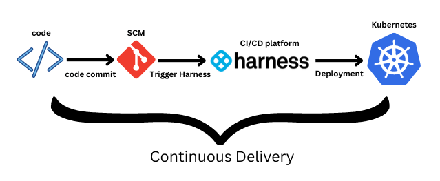
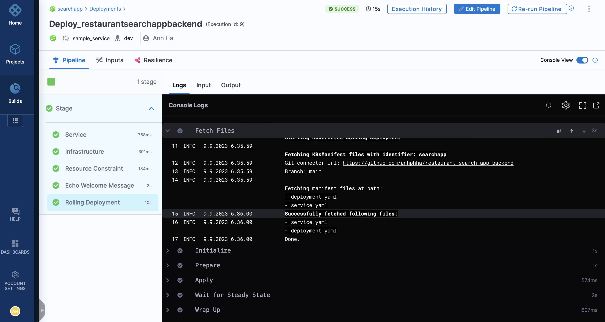
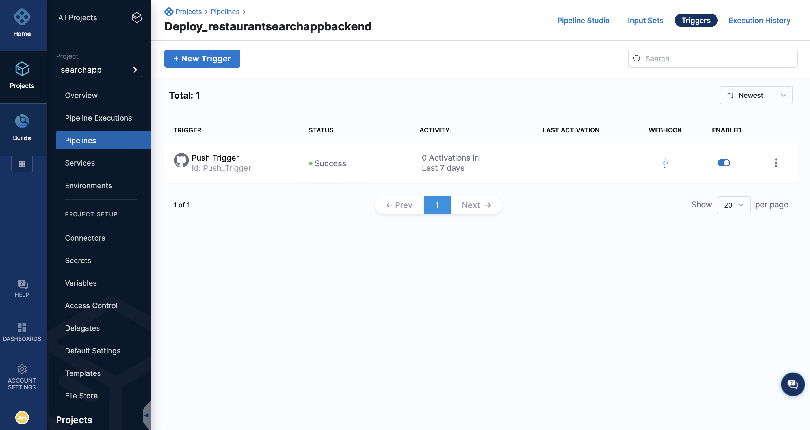

# Restaurant Search App Backend

#### This is a assignment for WOLT.

#### Created and made by Anh Ha

## Overview

A list of restaurants is an important element in Wolt app. Depending on where our customers are located, they will be able to order food from few dozen or even from hundreds of different restaurants. Views in the app (Discovery, Search, Delivers, Nearby) sort restaurants based on the delivery time, popularity, rating and various other factors when trying to find the most relevant matches for each customer.

## Restaurant data

`restaurant.json` contains fifty restaurants from central Helsinki area. Each object has a set fields providing more information about the restaurant, like name, image and location.

Example:

```
{
    "city": "Helsinki",
    "currency": "EUR",
    "delivery_price": 390,
    "description": "Japanilaista ramenia parhaimmillaan",
    "image": "https://prod-wolt-venue-images-cdn.wolt.com/5d108aa82e757db3f4946ca9/d88ebd36611a5e56bfc6a60264fe3f81",
    "location": [
        24.941786527633663,
        60.169934599421396
    ],
    "name": "Momotoko Citycenter",
    "online": false,
    "tags": [
        "ramen",
        "risotto"
    ],
    "blurhash": "j2DUFG8jbu8AXuLIT5Tt0B01R2;;",
}
```

Fields:

- City : A city where the restaurant is located (type: string)
- Currency: ISO 4217 code of the currency the restaurant is using (type: string)
  \_ Delivery price: Delivery cost from the restaurant to a customer. The price is stored as subunits, so 390 in this case would be 3.90€ (type: integer)
- Description: More information about what kind of restaurant it is (type: string)
- Image: A link to restaurant's image (type: string)
- Location: Restaurant's location in latitude & longitude coordinates. First element in the list is the longitude (type: a list containing two decimal elements)
- Name: The name of the restaurant (type: string)
- Online: If true, the restaurant is accepting orders at the moment. If false, then ordering is not possible (type: boolean)
- Tags: A list of tags describing what kind of food the restaurant sells, e.g. pizza / burger (type: a list of strings, max. 3 elements)
- Blurhash : See bonus task

## Backend task - search

Create a REST API endpoint that allows searching restaurants. API needs to accept three parameters:

- q: query string. Full or partial match for the string is searched from name, description and tags fields. A minimum length for the query string is one character.
- lat: latitude coordinate (customer's location)
- lon : longitude coordinate (customer's location)
  API should return restaurant (objects) which match the given query string and are closer than 3 kilometers from coordinates.

Example query:

```
/restaurants/search?q=sushi&lat=60.17045&lon=24.93147
```

This search would return restaurants (in JSON format) which contain a word sushi and are closer than 3km to the point [60.17045, 24.93147].

Please do not use any on-disk database (MySQL, PostgreSQL, ...) or ElasticSearch in this assignment. The task can be completed without them.

## Bonus task: Blurhash

Restaurant data also includes a field called blurhash. As a bonus task you can figure out what this field is and use it:

- In frontend task you can render the blurhash data
- In backend task you can e.g. validate that blurhash-field is correct when loading data from restaurant.json

There are some ready-made libraries for manipulating blurhash values. Feel free use those or create your own one.

Bonus task is completely optional and it doesn't affect how we review assignments. It exists only for fun! 😀

## Few tips

- Everyone in Wolt loves clean code
- Everyone in Wolt also loves good tests
- Try to figure out what is the essential part in this task. Focus on that first.
- Don't forget README.md with clear instructions how to get the project up and running

# TESTING FLASK FRAMEWORK WITH PYTEST

## Installation

```Python
python3 -m venv venv
```

```Python
pip install python-dotenv
```

```Python
virtualenv flask
```

```Python
source venv/bin/activate
```

```Python
pip install flask
```

```Python
pip install pytest
```

```Python
pip freeze > requirements.txt
```

```Python
pip install -r requirements.txt
```

## Running the Application

```Python
FLASK_APP=app.py flask run
```

## Execution all the Tests

To execute all the tests, run the following command:

```Python
pytest
```

OR

```Python
python -m pytest
```

## Execution all the Tests with stdout response

To execute all the tests, run the following command:

```Python
pytest -s
```

## Executing only grouped Tests

To only execute the get_request grouped tests, run the following command:

```Python
pytest -m get_request
```

# SETUP CI/CD AND DEPLOYMENT AUTOMATION

|                                                           |
| --------------------------------------------------------- |
|  |

- [x] Set up a cluster
- [x] Package your application into containers
- [x] Define the desired state of your application using manifests
- [x] Push your code to an SCM platform
- [x] Use a CI/CD tool to automate. Use a specialized CI/CD platform such as Harness to automate the deployment of the application.
- [x] Expose the application
- [x] Monitor and manage your application

### Prerequisites

- [x] Free Harness cloud account
- [x] Download and install Node.js and npm
- [x] GitHub account, we will be using our sample notes application
- [x] Kubernetes cluster access. Besides cloud services, you can use Minikube or Kind to create a single-node cluster

### Step 1: Containerize the application

```Python
# Use an official Python runtime as a parent image
FROM python:latest

# Set the working directory to /app
WORKDIR /app

COPY ./requirements.txt /app/requirements.txt

# Install any needed packages specified in requirements.txt
RUN pip install -r requirements.txt

# Copy the current directory contents into the container at /app
COPY . /app

# Make port 80 available to the world outside this container
EXPOSE 80

# Run app.py when the container launches
ENTRYPOINT [ "python", "app.py"]
```

For Mac M1, use the following command

```Python
docker buildx build --platform=linux/arm64 --platform=linux/amd64  -t docker.io/$your docker hub user name/$image name:$tag name --push  -f ./Dockerfile .
```

For other than Mac M1, use the below commands to build and push the image:

```Python
docker build -t $your docker hub user name/$image name .

#Example 1
docker build -t phanha/searchapp .
```

```Python
docker push $your docker hub user name/$image name .

#Example 2
docker push phanha/searchapp
```

### Step 2: Create or get access to a Kubernetes cluster

Make sure to have access to a Kubernetes cluster from any cloud provider. You can even use Minikube or Kind to create a cluster.

You can use Minikube for local development or set up a cluster on a cloud provider like **GKE (`Google Kubernetes Engine`), EKS (`Amazon Elastic Kubernetes Service`), or AKS (`Azure Kubernetes Service`).**

- To set up Minikube, follow the **[official Minikube installation guide](https://minikube.sigs.k8s.io/docs/start/)**.
- To set up a cluster on a cloud provider, follow their respective documentation.

### Step 3: Make sure the Kubernetes manifest files are neat and clean

- [x] Create deployment.yaml file and service.yaml file.
- [x] Apply the manifest files with the following commands. Starting with deployment and then service yaml file.

```Python
kubectl apply -f deployment.yaml
```

```Python
kubectl apply -f service.yaml
```

Verify the pods are running properly as expected after applying the kubectl apply commands.

```Python
kubectl get pods
```

### Step 4: Automate the deployment using Harness

```Python
kubectl get ns
```

```Python
#install Helm
$ curl -fsSL -o get_helm.sh https://raw.githubusercontent.com/helm/helm/main/scripts/get-helm-3
$ chmod 700 get_helm.sh
$ ./get_helm.sh
```

```Python
kubectl get pods -n harness-delegate-ng
```

### Results

|                                                    |
| -------------------------------------------------- |
|         |
|  |

# Details

This repo is built following a tutorial published on CircleCI blog under the CircleCI Guest Writer Program.
Blog post:
- [Testing Flask Framework with Pytest](https://circleci.com/blog/testing-flask-framework-with-pytest/)
- [Kubernetes Guidelines ](https://dev.to/pavanbelagatti/deploying-an-application-on-kubernetes-a-complete-guide-1cj6)